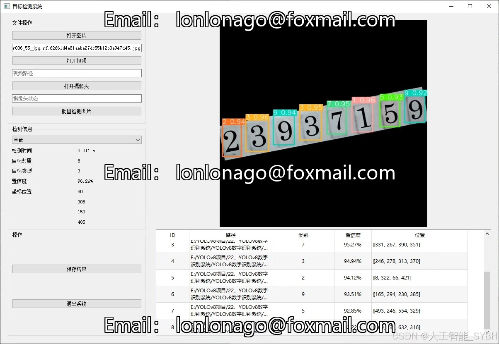
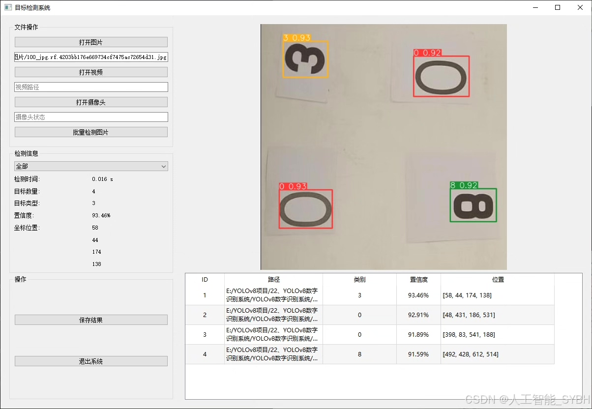
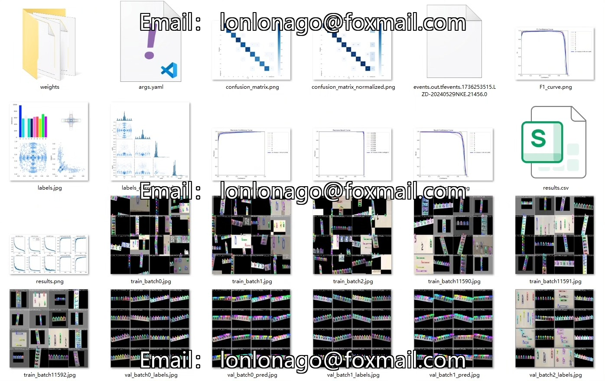
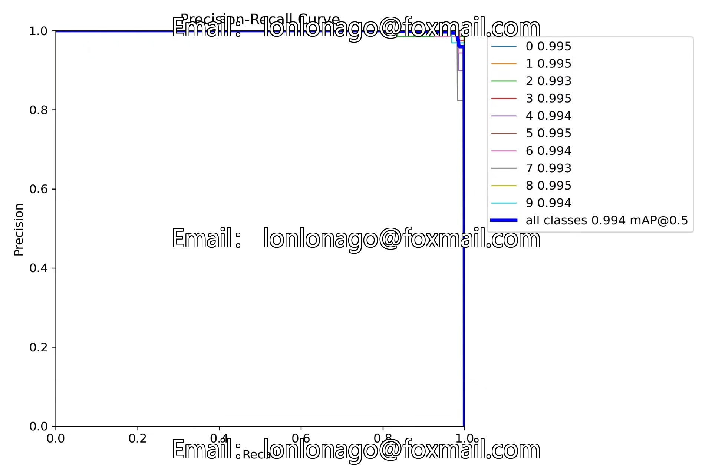
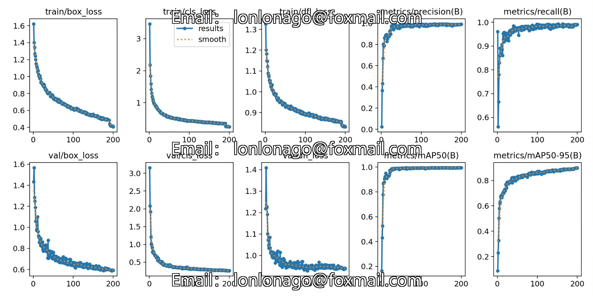
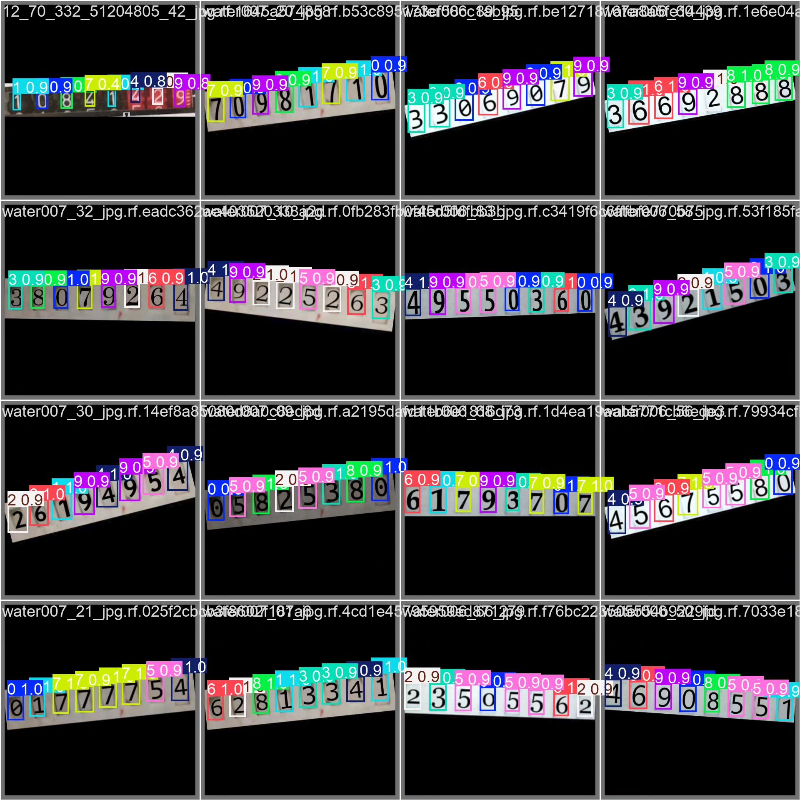
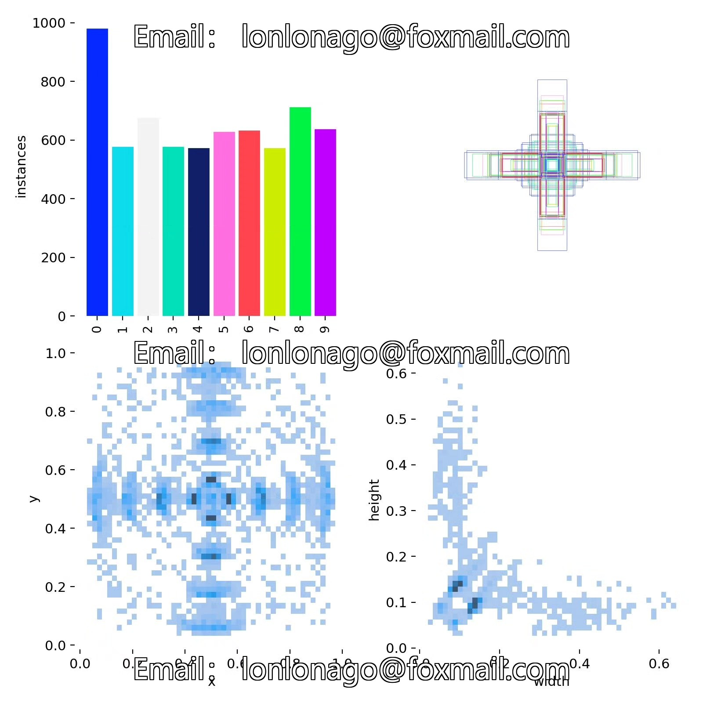
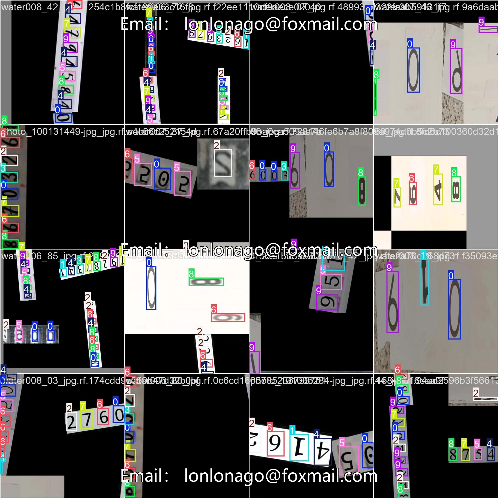

# YOLOv8-based deep learning system for digital recognition (YOLOv8+YOL)

## Body

This project is based on the YOLOv8 object detection algorithm to build a highly efficient and accurate digital recognition system. It is specifically designed for detecting and recognizing ten categories of numbers (0-9) in images or video streams. The system utilizes deep learning techniques, training and optimizing on a dataset of 966 training images, 99 validation images, and 50 test images, ensuring that the model has high generalization capabilities and robustness. YOLOv8, as one of the most advanced real-time object detection algorithms currently available, improves the recognition accuracy of small targets (such as numbers) while maintaining high detection speed, making it suitable for various practical application scenarios.

The company's products have obtained the official commercial license certification from YOLO.

We provide after-sales service:

After payment, we will provide a WeChat account for any questions you may have.

Environment configuration: We will provide an instructional tutorial for setting up the environment, with WeChat providing answers to questions.

Remote installation services: If you need remote configuration, an additional fee of 69 is required, with all fees refunded if the configuration fails (only the installation fee is refunded for older computers).

Retraining the dataset: Once the environment is set up, you can train on your own computer. If you need us to retrain, just pay 69 plus the computing power fee (2.5 yuan/hour).

Full after-sales service

## Images

## Payment

Here is a pay link on Stripe ( https://buy.stripe.com/3cs8yP7sY87d0vu9AB ). Please contact me lonlonago@foxmail.com after funding $89, and I will send you a complete data files , thank you!

